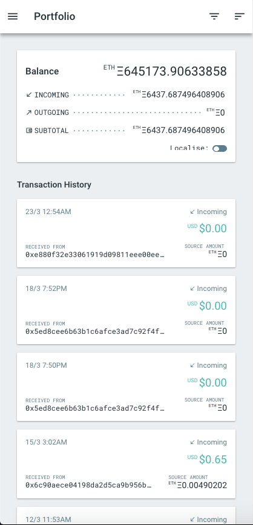

<!-- This README.md template is adapted from PurpleBooth's GitHub Gist https://gist.github.com/PurpleBooth/109311bb0361f32d87a2 -->

# Tx Ethereum Block Explorer

A block explorer web application for Ethereum. This application lets users track their ETH balance and transactions.

## Getting Started

To access and use Tx, please visit [https://hliejun.github.io/ethereum-explorer](https://hliejun.github.io/ethereum-explorer/app/portfolio) or [https://ethereum-explorer.appspot.com](https://ethereum-explorer.appspot.com/app/portfolio).

For the application to function, you will need:

- API Key (request from @hliejun)
- Valid Ethereum Address (42 chars, including prefixed with `0x`)

> Before using, please ensure that you read and agree to the Terms of Service and Privacy Policy, as shown in the application.

## Features

### Single Page Application


Tx is built with [ReactJS](https://reactjs.org) and [React Router](https://reacttraining.com/react-router) to realise a Single Page Application (SPA) experience with declarative routing. The result is a performant application navigable by both in-app routing links and by URL.

### Responsiveness




It adapts to various screen sizes and orientations, delivering a mobile-first experience consistent across devices.

### Filter and Sort


You can filter the transactions history by type and order them by date and amount. Redundancies are built into the UI to ensure accessibility on mobile, tablet and desktop environment.

### URL Queries


Filter, sort and page states can be edited directly from the URL query string, allowing users to be more efficient at browsing and bookmarking stateful queries.

### Localised Rates


Ethereum can be converted and localised into one of the 6 currencies:

- China Yuan (CNY)
- Great Britain Pound (GBP)
- Japan Yen (JPY)
- Korea Won (KRW)
- Singapore Dollar (SGD)
- United States Dollar (USD)

This allows users to browse meaningful and relatable transactions history.

### Copy To Clipboard


Instead of copying transaction data field by field, you can copy the entire set in a single-click. The output is formatted neatly and hierarchically by tabs.

### Night Mode


You can also optionally turn on dark mode if you prefer a dark theme or are viewing under low-light conditions.

## API Endpoints

This project uses API services from [Open Exchange Rates](https://openexchangerates.org/about) and [Etherscan](https://etherscan.io/apis). The purposes of these services are as follows:

- **Open Exchange Rates** - periodic updates on a bucket of currency rates pegged against ETH
- **Etherscan** - query balance and last 1000 normal transaction history for a given Ethereum address

API calls in this project are intercepted by a [gateway](https://github.com/hliejun/ethereum-gateway) to protect API keys, transform data and rate limit requests to fit with the third-party API constraints.

## Development

To contribute to this project, please refer to the following sections to ready your development environment.

### Prerequisites

Before we begin, please ensure that you have [Git](https://git-scm.com/downloads) and [NodeJS](https://nodejs.org/en/download) installed. You can manually install them using packages from their download page. Alternatively, you can also use your favourite OS package manager to install them.

The `/.gitignore` file is included to leave out specific items from your commits.

This project also utilises [ESLint](https://eslint.org/docs/user-guide/getting-started), [SASSLint](https://github.com/sasstools/sass-lint) and [Prettier](https://prettier.io/docs/en/install.html) to enforce coding style and standards. You can optionally install these linters/formatters globally or locally and set up for use with your favourite editor using their respective editor plugins.

Linter configuration files are included to define linting rules:

- `/.eslintrc.json` is used for `.js` and `.jsx` files.
- `/.sass-lint.yml` is used for `.css` and `.scss` files.
- `/.prettierrc.json` is used for general code formatting and is especially handy when used with hackable code editors such as [Visual Studio Code](https://code.visualstudio.com) or [Atom](https://atom.io).

### Setup

1. First, we begin by cloning this repository using Git.

   Open Terminal and navigate to your preferred directory:

   ```bash
   # e.g. cd ~/developer/projects
   cd [your preferred directory]
   ```

   Clone this repository to your current directory:

   ```bash
   # e.g. git clone https://github.com/hliejun/ethereum-explorer.git
   git clone [repository url]
   ```

   If you are still unsure of how to find your repository url, you can follow [Step 2 of the fork-a-repo guide](https://help.github.com/en/articles/fork-a-repo).

2. Next, we install all the required dependencies using a NodeJS package manager.

   Enter the local directory of the cloned repository:

   ```bash
   # e.g. cd ethereum-explorer
   cd [project name]
   ```

   Install NodeJS dependencies using [npm](https://www.npmjs.com/get-npm) or [Yarn](https://yarnpkg.com/en/docs/install):

   ```bash
   # If you are using npm:
   npm i

   # If you are using Yarn:
   yarn
   ```

3. Link your editor workspace to utilise the linter and formatter files provided in the cloned repository.

   To make use of the linter files, you need to find and install the right plugins for your editor:

   ESLint - [VSCode](https://marketplace.visualstudio.com/items?itemName=dbaeumer.vscode-eslint) | [Atom](https://atom.io/packages/linter-eslint) | [Sublime Text](https://github.com/SublimeLinter/SublimeLinter-eslint)

   SASSLint - [VSCode](https://marketplace.visualstudio.com/items?itemName=glen-84.sass-lint) | [Atom](https://atom.io/packages/linter-sass-lint) | [Sublime Text](https://github.com/skovhus/SublimeLinter-contrib-sass-lint)

   Prettier - [VSCode](https://marketplace.visualstudio.com/items?itemName=esbenp.prettier-vscode) | [Atom](https://atom.io/packages/prettier-atom) | [Sublime Text](https://github.com/jonlabelle/SublimeJsPrettier)

### Quick Start

This project utilises npm scripts defined in `package.json`.

To start this application locally in development mode, you can run:

```bash
# If you are using npm:
npm run start:dev

# If you are using Yarn:
yarn start:dev
```

This is equivalent to running the `webpack-dev-server` module locally:

```bash
# Refer to package.json under 'scripts' for more details
./node_modules/.bin/webpack-dev-server --env.ENVIRONMENT=development --mode development  --config webpack.config.dev.js --host 0.0.0.0
```

Now with the application running, you can preview (with hot reload) by visiting `localhost:3000/`. Since the CLI parameter included a host name of `0.0.0.0`, you can also access the application (with hot reloading) through other devices connecting to the same network at "[your IP address]:3000" (e.g. `192.168.1.1:3000/`).

### Babel / Webpack

#### Babel

The ReactJS project module is transpiled by Babel then bundled by Webpack. Babel is configured using `/.babelrc`. Note that this project uses `plugin-proposal-class-properties` and `plugin-syntax-dynamic-import`.

#### Webpack + `webpack-dev-server`

In development mode, Webpack Dev Server will serve at the root `/` level of the `localhost`, port number `PORT=3000`, hence `localhost:3000/`.

Notice that the `--config` flag in the package.json scripts refer to the Webpack config file specific to the build environment marked by `--mode`. For development, Webpack is configured using `/webpack.config.dev.js`.

> For production, you can configure Webpack from `/webpack.config.prod.js`. Read more on [Deployment](#deployment).

#### HTML Webpack Plugin

You should notice in the Webpack configuration, the `index.html` file is dynamically created by `html-webpack-plugin` using a template file `/index.html`. This allows us to automatically customise the bundle file paths by environment.

#### Bundle Analyzer Plugin

On top of that, you should also find a source map explorer open when you start the application in development. This is the `webpack-bundle-analyzer` in action and we use this to inspect the bundle size.

#### Environment Variables

This project also uses `dotenv` to isolate enivronment-specific variables across `.env` files. For development, you can specify variables in `/.env.development` and thereafter you can access them in your source files using `process.env.[YOUR_KEY]`.

> For production, you can configure environment variables from `/.env.production`. Read more on [Deployment](#deployment).

### Structure

#### General


The project is split into different aspects, namely:

- `/src/assets` containing multimedia resources and shared SASS stylesheets
- `/src/components` containing page specific,shared and root/routing components
- `/src/constants` containing shared constant declarations organised into chunks
- `/src/redux` containing redux-specific files such as action creators, reducers, selectors, store, middlewares
- `/src/index.js` containing entry-point logic and mounting point for our single-page application (SPA)

> Currently, service workers, local and session storage handlers will also be placed together with redux files, but it shall be refactored into its own folder in the near future.

#### Components


Components are differentiated into 2 types, namely `scenes` and `common`. Scenes are most often than not container components that contain page-specific business logic, whereas Common are shared components, most of them functional and presentational. Suppose that we have a component folder `/src/components/*/MyComponent`, then for each component folder, the structure is as follows:

- `./MyComponent.jsx` is the main parent React component
- `./_mycomponent.scss` is a partial main SASS stylesheet, to be imported by `MyComponent`
- `./ChildComponent.jsx` is the child React component that is specific to this parent component and cannot be shared
- `./_childcomponent.scss` is a partial child-component SASS stylesheet, to be imported by `ChildComponent`
- `./index.js` is the import entry point for this component, where we control the exported modules for this component

With collocation, partial stylesheets and respective components are tightly coupled and can be modularly added or removed. Importing of components in other containers will be neater without duplicated path names, and the entry point allows us control over the visibility of entities in the module.

#### Redux


[Redux](https://redux.js.org/introduction/getting-started) is used in this project to control data models that are abstracted and decoupled away from views or components. These models are updated and maintained by the API gateway and persisted by local or session storage between full-reloads. The models are namely grouped into:

- `auth` for session authentication
- `ethereum` for transactions, balance and exchange rates
- `settings` for application-specific controls and customisations
- `user` for user-specific credentials and information

Then, these models form the basis for the Redux aspects:

- `/src/redux/actions` are action creators for creating synchronous or asynchronous actions (with a given payload)
- `/src/redux/reducers` contain instructions on how to update the state given a specific action (and payload)
- `/src/redux/selectors` are ways to group and read the state for different situations and is placed here instead of alongside view components as the ways to interpret state data should be a business logic concern independent of views
- `/src/redux/store.js` creates the Redux store with middlewares, and specifies which part of the store state is persisted and recovered with local and session storage
- `/src/redux/storage.js` hold the implementation of local and session storage, and can also be extended to include other forms of persisted storage options

### Software Architecture Design


This application uses the [React-Redux](https://react-redux.js.org/introduction/quick-start) architecture to achieve a uni-directional data flow, with views as a function of states. Notice that the business logic contained by Redux is independent of the view logic. The views are dependent on Redux store and shared resources, while the Redux store is dependent on the API gateway to aggregate results from a bucket of third-party API services.

### Implementations

Implementations will be discussed in the near future. The plan is to discuss notable implementation techniques and examples with referencing code snippets. Come back again for updates!

## Running Tests

Tests will be implemented in the near future. The plan is to introduce `.test.js` and `.spec.js` files collocally with components for quick lookup and modularity, then run the tests using [Jest](https://jestjs.io). Come back again for updates!

## Deployment

### Quick Start (Production)

To build the application in production mode, you can run:

```bash
# If you are using npm:
npm run build

# If you are using Yarn:
yarn build
```

This is equivalent to running `webpack` module in production mode:

```bash
# Refer to package.json under 'scripts' for more details
./node_modules/.bin/webpack --mode production --env.ENVIRONMENT=production --config webpack.config.prod.js --output-public-path='/'
```

After the build is complete, you can serve the application:

```bash
# If you are using npm:
npm start

# If you are using Yarn:
yarn start
```

This is equivalent to running an express server instance created by `/server.js` with `node` in production mode.

You can now preview the production-ready application locally by visiting `localhost:9000/`.

> Please note that the API gateway in use is configured to whitelist production domains for production builds. As such, requests to the gateway will fail Cross Origin Resource Sharing (CORS) preflight request. To resolve this, consider connecting the application to your own API gateway and whitelist your domain accordingly. You can conveniently do so using [cors](https://github.com/expressjs/cors) node module. Otherwise, submit a request to @hliejun to whitelist your domain.

### Webpack (Production)

Production webpack config

- html webpack
- copy (and build directory)
- env variables
- compression

server.js

- serving locally
- serving to Google App Engine (.gcloudignore)
- serving static SPA to GitHub page sub-directory (index.gh.html, 404.html)

#### Webpack + `/server.js`

In production mode, Webpack is configured to serve at output path `/` by default and the Express server `/server.js` is set to default to port number `PORT=9000`, hence `localhost:9000/`. Note that this is changed when deploying to domains with sub-directories, such as GitHub pages. To customise the output path, you can either set in the configuration file, or use a `--output-public-path` flag as seen in the `package.json` scripts. Note that the build files can be found in `/build` and they are broken into chunks for code splitting.

For production, Webpack is configured using `/webpack.config.prod.js`.

> For development, you can configure Webpack from `/webpack.config.dev.js`. Read more on [Development](#development).

#### HTML Webpack Plugin

For production, `html-webpack-plugin` generates `index.html` based on whether the deployment is for GitHub pages or normal domains. For normal root domains, `/index.html` is used as template whereas for GitHub pages, `/index.gh.html` is used. This is because `/index.gh.html` has its resources mapped for a sub-directory, in this case `ethereum-explorer`.

You will need to customise this based on your sub-directory name, or in GitHub pages case, your GitHub project name. If you wish to automate this process, consider using `create-react-app` instead, or use a compatible webpack plugin for manifests and favicons.

#### Copy Webpack Plugin

When you build this project for production, `copy-webpack-plugin` is used to copy resource files from `/public` to `/build`. This is to put resources such as favicons and manifests into the same directory as the `index.html` entry point.

#### Compression Plugin

The `compression-webpack-plugin` is used to generate `.gz` compressed g-zip versions for the bundle chunks for faster download time on supported devices.

#### Environment Variables

For production, you can specify environment variables in `/.env.production` instead.

> For development, you can configure environment variables from `/.env.development`. Read more on [Development](#development).

### Google App Engine

In this branch, the application is configured to deploy to Google App Engine as a NodeJS 8 application. Notice that in the `/app.yaml` configuration file, the path handlers are configured to fetch the static files by pointing to the files in `/build`.

Additionally, the `/.gcloudignore` file specifies the files not to be deployed to Google Cloud with the project.

To deploy, you will need to [setup](https://cloud.google.com/sdk/install) `gcloud` in your CLI, then:

```bash
# If you are using npm:
# e.g. npm run build && gcloud app deploy --project ethereum-explorer
npm run build && gcloud app deploy --project your-project-name

# If you are using Yarn:
# e.g. yarn build && gcloud app deploy --project ethereum-explorer
yarn build && gcloud app deploy --project your-project-name
```

This will deploy this application to your Google Cloud project, based on the success of your build. Be sure to follow up the prompts by `gcloud` thereafter as it is an interactive shell command.

### GitHub Pages

As Github pages have issues with SPA applications and React Router, a few steps were taken to circumvent the issue:

- `index.gh.html` and `404.html` have augmented resource paths to factor in the project name sub-directory and have injected scripts to handle 404 redirects since GitHub does not comprehend the SPA routes
- `BrowserRouter` in `/src/components/Router.jsx` uses `process.env.PUBLIC_URL` as the `basename` prop and this environment variable is dynamically set during build process by `webpack` enivronment CLI flag `--env.GH`
- `--output-public-path` is set to the project name in the `predeploy` script where the project is built for GitHub pages deployment

To deploy to GitHub, you can do:

```bash
# If you are using npm:
npm run deploy

# If you are using Yarn:
yarn deploy
```

This will run the `predeploy` and `deploy` script, equivalent to:

```bash
# e.g. ./node_modules/.bin/webpack --mode production --env.ENVIRONMENT=production --env.GH --env.PUBLIC_URL='/ethereum-explorer' --config webpack.config.prod.js --output-public-path='/ethereum-explorer/' && ./node_modules/.bin/gh-pages -d build

./node_modules/.bin/webpack --mode production --env.ENVIRONMENT=production --env.GH --env.PUBLIC_URL='/your-project-name' --config webpack.config.prod.js --output-public-path='/your-project-name/' && ./node_modules/.bin/gh-pages -d build
```

In other words, `webpack` builds the application with the flag variables, then `gh-pages` deploy the content in `/build` to GitHub `gh-pages` branch.

## Built With

> NOTE: Dev dependencies are omitted for brevity

### Dependencies

- `axios` - Promise-based HTTP client for handling async requests in actions
- `classnames` - Utility tool to resolve and aggregate className for relatively cleaner class declarations
- `css-vars` - Mixins for using CSS custom properties in SASS to change themes dynamically
- `dayjs` - Lightweight, modern date-parsing library to parse and format timestamps
- `express` - Minimalistic web application framework for serving production build
- `gh-pages` - Automated publishing of production build to gh-pages branch
- `lodash` - Performant utility library, used for debouncing and throttling user inputs / interactable callbacks
- `prop-types` - Runtime type-checking for React props
- `query-string` - Parse and stringify URL query strings
- `react-hot-loader` - Real-time React components tweaking
- `react-redux` - React bindings for Redux
- `react-router-dom` - Declarative routing for React
- `react-waypoint` - Modular scroll state listener for handling scroll-dependent side-effects
- `react` + `react-dom` - React library for composable views as functions of state
- `redux-logger` - Redux store logging middleware for debugging
- `redux-thunk` - Redux store asynchronous action middleware for API gateway requests
- `redux` - State container and handling to abstract business logic from components
- `reselect` - Memoised, composable selector library for efficient derivation of data from state / reducers
- `webfontloader` - Non web-safe font loading

## Credits

I have made references to work done by the following individuals and organisations and compiled a list of authors that deserve credits. If you are the creator or author of the work referenced and wishes for references to your work to be removed from this project, or to be removed from this 'Credits' list, please contact me at hliejun.dev@gmail.com.

If you should find that you are missing from the credit roll, or if I have violated your work license, or that your work is used but uncredited, or any part of this project is similar to your work and wishes to be credited, please contact me immediately through the email above.

### Assets

**Countries Flags Icons** - Icons made by
[Freepik](https://www.freepik.com)
from
[www.flaticon.com](https://www.flaticon.com)
is licensed by
[CC 3.0 BY](http://creativecommons.org/licenses/by/3.0)

**Google Material Design Icons** - Icons made by
[Google](https://design.google)
from
[material.io](https://material.io/tools/icons)
is licensed by
[Apache License Version 2.0](https://www.apache.org/licenses/LICENSE-2.0.txt)

### Code Snippets

> NOTE: Code snippets borrowed from online sources are annotated with:  
> `// Credit: path-to-source`

**Material Design Elevation SASS Mixins** - by
[paulmelnikow](https://github.com/paulmelnikow)
from
[GitHub Gist - shadows.scss](https://gist.github.com/paulmelnikow/7fcfbe4f68e5df7fe326)

**Scroll Shadow** - by
[Lea Verou](http://lea.verou.me)
from
[Pure CSS scrolling shadows with background-attachment: local](http://lea.verou.me/2012/04/background-attachment-local)

**Material Design Select Element** - by
[Victor Meyer](https://codepen.io/pudgereyem)
from
[codepen.io](https://codepen.io/pudgereyem/pen/PqBxQx)

**CSS Custom Checkbox** - by
[w3schools](https://www.w3schools.com)
from
[How To - Custom Checkbox](https://www.w3schools.com/howto/howto_css_custom_checkbox.asp)

**Material Design Circular Progress SVG** - by
[Con Antonakos](https://codepen.io/ConAntonakos)
from
[codepen.io](https://codepen.io/ConAntonakos/pen/ryMaOX)

**CSS Variables Dynamic Themes** - by
[Mike Wilcox](https://itnext.io/@mjw56)
from
[itnext.io](https://itnext.io/css-variables-dynamic-app-themes-86c0db61cbbb)

## Contributing

Please read [CONTRIBUTING.md](CONTRIBUTING.md) for details on code of conduct, the process for submitting pull requests and other rules and regulations applied to contributors.

## Authors

- **Huang Lie Jun** - _Initial development_ - [hliejun](https://hliejun.github.io)

## License

This project is licensed under the [MIT License](https://choosealicense.com/licenses/mit/) - see the [LICENSE.md](LICENSE.md) file for details

## Acknowledgments and References

[**TenX**](https://tenx.tech/en) - Technical challenge implementation details and reference designs

[**Google Material Design**](https://material.io/design) - Style guides and references

[**Billie Thompson**](https://github.com/PurpleBooth) - GitHub `README.md` and `CONTRIBUTING.md` templates

[**Shopify**](https://www.shopify.com.sg) - `Privacy Policy` and `Terms of Service` templates
